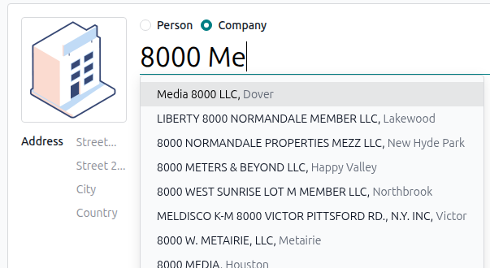

====================
Address autocomplete
====================

Odoo provides a feature to automatically complete contact address information using the Google
Places API. This service allows developers to retrieve detailed place information via HTTP requests.
As you begin typing an address, the system suggests a list of matching locations to simplify
data entry.

.. seealso::
   - `Google Maps Platform <https://mapsplatform.google.com/maps-products>`_
   - `Google Developers Documentation: Google Places API
     <https://developers.google.com/maps/documentation/places/web-service/autocomplete>`_

.. _address_autocomplete/places-api-configuration:

Google Places API configuration
===============================

To use Google for address autocompletion, you must first :ref:`enable the API
<address_autocomplete/enable-api>` and :ref:`create the required credentials
<address_autocomplete/generate_api_key>`.

.. _address_autocomplete/enable-api:

Enable the Google Places API
----------------------------

To enable the Google Places API, follow these steps:

#. Go to the `Google Cloud console <https://console.cloud.google.com/getting-started>`_.
#. `Create <https://dash.cloudflare.com/sign-up>`_ or `sign in <https://dash.cloudflare.com/login>`_
   to a Google account.
#. In the upper-left corner, click :guilabel:`Select a project` or the selected project's name if
   you have already created one. In the :guilabel:`Select a resource` pop-up, select a project, or
   create a :guilabel:`New Project`.
#. Open the :icon:`fa-bars` side panel, and go to :menuselection:`APIs & Services --> Enabled APIs &
   services`.
#. Click :icon:`fa-plus` :guilabel:`Enable APIs and services` at the top.
#. Search for :guilabel:`Places API` and select it.
#. Click the :guilabel:`Enable` button.
#. Complete the verification process.

.. important::
   Do not enable :guilabel:`Places API (New)`, as it is not yet supported by Odoo.

.. note::
   Google's pricing depends on the number of requests and their complexity.

.. _address_autocomplete/generate_api_key:

Generate API Credentials
------------------------

Once the :ref:`project is created and the Places API is enabled <address_autocomplete/enable-api>`,
you need to create API credentials. To do so, follow these steps:

#. Open the side panel of your project's dashboard, and go to :menuselection:`APIs & Services -->
   Credentials`.
#. Click :icon:`fa-plus` :guilabel:`Create credentials` :icon:`fa-caret-down`, then select
   :guilabel:`API key` from the dropdown menu.
#. In the :guilabel:`Create API key` panel, enter a :guilabel:`Name`.
#. In the :guilabel:`Select API restrictions`, specify which APIs the key can access if there are
   several APIs configured in your project. Ensure :guilabel:`Places API` is selected.
#. Click :guilabel:`Create`.

.. note::
   The API key can be restricted to allow requests only from specific websites, IP addresses, or
   apps.

.. important::
   Save your API key securely. Do not share it publicly or expose it in client-side code.

Odoo configuration
==================

Once the API key is generated, connect the Odoo database to the Google Places API. To do so:

#. Go to the **Settings app**.
#. Navigate to the :guilabel:`Integrations` section.
#. Enable :guilabel:`Google Address Autocomplete`, and :guilabel:`Save`.
#. Insert your :ref:`Google Places API key <address_autocomplete/generate_api_key>` in the
   :guilabel:`Paste your API Key` field.
#. Click :guilabel:`Save`.

.. seealso::
   - :ref:`Address validation with Google Places API <ecommerce/checkout/address-validation>`
   - :ref:`Geolocalization with Google Places API <geolocation/google-places-api>`
